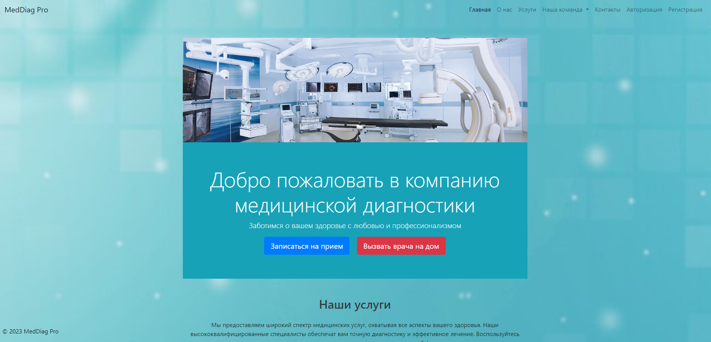

# Medical Diagnostics

## Описание проекта

 Медицинский диагностический сайт предназначен для предоставления широкого спектра медицинских услуг. Сайт обеспечивает пациентов возможность прохождения лабораторных исследований, консультаций кардиолога, рентгенологии, компьютерной томографии (КТ), магнитно-резонансной томографии (МРТ) и ультразвуковой диагностики (УЗИ).



### Требования к окружению

- python
- postgresql
- django
- bootstrap

## Установка

1. Клонировать репозиторий:

    ```bash
    git clone https://github.com/N1zbel/Medical_Diagnostics
    cd Medical_Diagnostics
    ```

2. Установить зависимости:

    ```bash
    pip install -r requirements.txt
    ```
3. Настройте файл .env : Создайте файл .env в корневой директории проекта и добавьте в
   него переменные среды, например:

- SECRET_KEY = Ключ от джанго приложения
- CACHE_LOCATION = redis://localhost:6379/1
- CACHE_ENABLED = True
- DATABASE_NAME = Название Базы данных
- ADMIN_PASSWORD = Пароль админа
- GMAIL = Ваша почта gmail
- GMAIL_PASSWORD = Пароль приложения от gmail
- POSTGRES_USER = Имя пользователя постгрес
- POSTGRES_PASSWORD = Пароль постгреса
- EMAIL = Ваш емейл

4. Применить миграции:

    ```bash
    python manage.py migrate
    ```

## Запуск

Запустить сервер разработки:

```bash
python manage.py runserver
```

- Приложение будет доступно по адресу http://127.0.0.1:8000/.


## Использование 
Сайт предоставляет удобный интерфейс для записи на лабораторные исследования, получения консультаций специалистов, а также прохождения различных видов медицинских обследований.

## Автор проекта

Рязанов Андрей

Если у вас есть вопросы или предложения по улучшению проекта, свяжитесь со мной по почте nizbe@inbox.ru.
